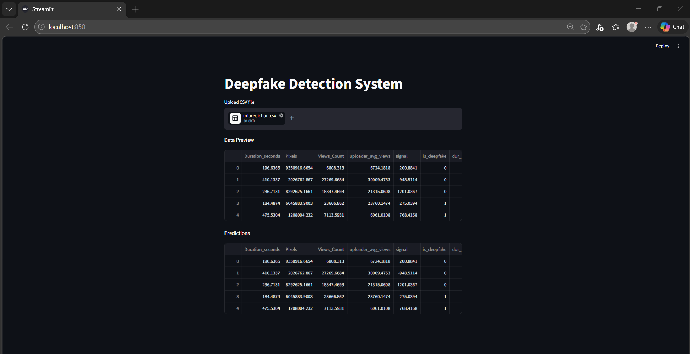

# Deepfake Detection System

An end-to-end Machine Learning web application built using Streamlit that allows users to upload datasets and predict whether content is deepfake or not using a classification model.

---

## 🚀 Features
- Upload CSV datasets
- Automatic data preview
- Machine Learning-based prediction
- Handles multiple dataset formats dynamically
- Displays model accuracy

---

## 🧠 Tech Stack
- Python
- Pandas
- Scikit-learn
- Streamlit

---

## ⚙️ Project Workflow
1. Upload dataset
2. Data preprocessing
3. Feature selection
4. Model training using Logistic Regression
5. Generate predictions
6. Display model accuracy

---

## 📊 Model Details
- Algorithm: Logistic Regression
- Type: Classification Model
- Target Column: `is_deepfake`
- Output: 0 (Real) / 1 (Deepfake)

---

## 📸 Application Screenshot

---

## 🔗 Live Application
https://deepfake-arpit.streamlit.app

## 📂 GitHub Repository
https://github.com/arpit-systems/deepfake-detection-system

---

## ⚠️ Important Notes
- The model works only if the dataset contains the `is_deepfake` column
- If the target column is missing, the app will display only the data preview
- Only numeric columns are used for model training

---

## 👨‍💻 Author
**Arpit Sharma**

---

## 💡 Future Improvements
- Add XGBoost model for better accuracy
- Improve UI/UX of Streamlit dashboard
- Add data visualization (graphs & charts)
- Deploy using cloud for real-time access

---
